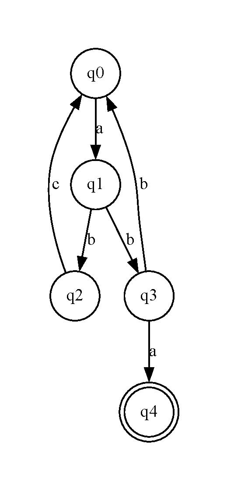
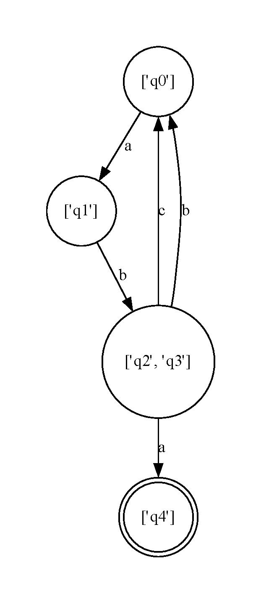

# Determinism in Finite Automata. Conversion from NDFA 2 DFA. Chomsky Hierarchy.

---

#### Course: Formal Languages and Finite Automata
#### Author: Corneliu Catlabuga FAF-213

----

## Theory
The Finite Automata for the laboratory work (v9):

```
Q = {q0,q1,q2,q3,q4},
∑ = {a,b,c},
F = {q4},
δ(q0,a) = q1,
δ(q1,b) = q2,
δ(q2,c) = q0,
δ(q1,b) = q3,
δ(q3,a) = q4,
δ(q3,b) = q0.
```

## Tasks

---

1. Understand what an automaton is and what it can be used for.

2. Continuing the work in the same repository and the same project, the following need to be added:
    a. Provide a function in your grammar type/class that could classify the grammar based on Chomsky hierarchy.

    b. For this you can use the variant from the previous lab.

3. According to your variant number (by universal convention it is register ID), get the finite automaton definition and do the following tasks:

    a. Implement conversion of a finite automaton to a regular grammar.

    b. Determine whether your FA is deterministic or non-deterministic.

    c. Implement some functionality that would convert an NDFA to a DFA.
    
    d. Represent the finite automaton graphically (Optional, and can be considered as a __*bonus point*__):
      
    - You can use external libraries, tools or APIs to generate the figures/diagrams.
        
    - Your program needs to gather and send the data about the automaton and the lib/tool/API return the visual representation.

## Implementation

---

### Grammar classification
Returns the classification of the grammar based on Chomsky hierarchy.
```python
def get_classification(self):
    # Start with the most general classification
    classification = '3'

    for p in self.production.keys():
        # Check for class 1, if true break
        # Check for class 2

    for p in self.production.keys():
        # Check for class 0 condition

    return classification
```

---

### Finite Automaton to Regular Grammar conversion
Converts a finite automaton to a regular grammar.
```py
def to_grammar(self):
    from Grammar import Grammar

    production = {}

    for t in self.transitions.keys():
        # Get left side of production

    for t in self.transitions.keys():
        # Get the right side for each production

    return Grammar(self.states, self.alphabet, production, self.initial_state)
```

---

### Determinism check
Determines whether the finite automaton is deterministic or non-deterministic.
```py
def get_type(self):
    # Due to the why it's declared
    # The type can be determined by the type of transitions
```

---

### Non-deterministic Finite Automaton to Deterministic Finite Automaton conversion
Converts a non-deterministic finite automaton to a deterministic finite automaton.
```py
def to_dfa(self):
    dfa_final_states = []
    dfa_transitions = {}

    # Store all the DFA states starting with the initial state
    dfa_states = [[self.initial_state]]

    for states in dfa_states:
        # If new states are deduced, develope the new states until
        # no new states appear 
        
    for states in dfa_states:
        # Get the set of DFA states

    return FinalAutomata(dfa_states, self.alphabet, self.initial_state, dfa_transitions, dfa_final_states)
```

---

### Graphical representation
Generates a graphical representation of the finite automaton.
#### NOTE: Will only work if Graphviz is installed. If Graphviz is not installed, the function will generate a .gv file that can be used to generate the graph.
```python
def show_graph(self, name='graph'):
    import graphviz as gv

    graph = gv.Digraph()

    # Graph generation for NFA
    if type(self.final_states) == str:
        for state in self.states:
            shape = 'circle' if state not in self.final_states else 'doublecircle'
            graph.node(state, shape=shape)
        for state in self.transitions:
            for s in self.transitions[state]:
                graph.edge(state[0], s, label=state[1])

    # Graph generation for DFA
    if type(self.final_states) == list:
        for state in self.states:
            shape = 'circle' if state not in self.final_states else 'doublecircle'
            graph.node(repr(state), shape=shape)

        for state in self.transitions:
            for s in [self.transitions[state]]:
                graph.edge(repr(list(state[0])), repr(s), label=state[1])

    graph.view(filename=name+'.gv', directory='./graphs/')
```

## Output

---

```
Task 2:
Grammar classification: 3

Task 3a:
Grammar non-terminals:  ['q0', 'q1', 'q2', 'q3', 'q4']
Grammar terminals:  ['a', 'b', 'c']
Grammar start:  q0
Grammar productions:  {'q0': ['aq1'], 'q1': ['bq2', 'bq3'], 'q2': ['cq0'], 'q3': ['aq4', 'bq0']}

Task 3b:
FA1: NFA

Task 3c:
FA2: DFA
DFA states:  [['q0'], ['q1'], ['q2', 'q3'], ['q4']]
DFA alphabet:  ['a', 'b', 'c']
DFA initial state:  q0
DFA transitions:  {(('q0',), 'a'): ['q1'], (('q1',), 'b'): ['q2', 'q3'], (('q2', 'q3'), 'c'): ['q0'], (('q2', 'q3'), 'a'): ['q4'], (('q2', 'q3'), 'b'): ['q0']}
DFA final states:  [['q4']]
```

### Graphical representation
 